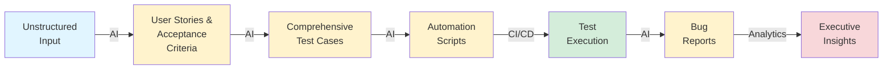

# 📊 Véridion Blueprint - Executive Summary

## System Overview

**Véridion** is an AI-driven Low-Code/No-Code (LCNC) platform that transforms software quality assurance by automating the entire testing lifecycle with Generative AI.

---

## 🎯 Business Value Proposition

| Traditional QA | Véridion AI |
|----------------|-------------|
| Manual requirement analysis (2-3 days) | AI synthesis in minutes |
| Manual test case writing (1-2 weeks) | Automated generation (< 5 min) |
| Script development (2-4 weeks) | AI-generated scripts (< 10 min) |
| Manual bug investigation (4-8 hours) | AI root cause analysis (< 2 min) |
| 50-60% test coverage | 90%+ automated coverage |
| Reactive quality issues | Predictive quality insights |

### ROI Projection

- **70% reduction** in manual QA effort
- **50% faster** release cycles
- **40% fewer** production defects
- **30% reduction** in QA costs

---

## 🔄 End-to-End Workflow



---

## 📋 Feature Matrix

| Stage | Input | AI Processing | Output | Time Saved |
|-------|-------|---------------|--------|-----------|
| **1. Requirement Synthesis** | Meeting notes, emails | NLP + GPT-4 | User stories, Gherkin AC | 2-3 days → 5 min |
| **2. Test Case Design** | Acceptance criteria | Pattern recognition | Positive/Negative/Boundary tests | 1-2 weeks → 5 min |
| **3. Script Generation** | Test cases | Code generation | Playwright/Selenium scripts | 2-4 weeks → 10 min |
| **4. Test Execution** | Automation scripts | Test runner | Pass/fail results + artifacts | N/A |
| **5. Bug Triaging** | Failure logs | Root cause analysis | Categorized bug reports | 4-8 hrs → 2 min |
| **6. Analytics** | Test results | Trend analysis | Executive dashboard | Manual → Real-time |

---

## 🏛️ System Architecture (Simplified)

```
┌─────────────────────────────────────────────────────────┐
│                    USER INTERFACES                       │
│  Dashboard │ Req Synthesis │ Test Cases │ Analytics     │
└─────────────────────────────────────────────────────────┘
                              ↓
┌─────────────────────────────────────────────────────────┐
│                     API GATEWAY                          │
│             (Authentication & Rate Limiting)             │
└─────────────────────────────────────────────────────────┘
                              ↓
┌──────────────┬───────────────┬────────────┬─────────────┐
│   Requirement│  Test Case    │  Script    │  Execution  │
│   Service    │  Service      │  Service   │  Service    │
└──────────────┴───────────────┴────────────┴─────────────┘
                              ↓
┌─────────────────────────────────────────────────────────┐
│                   AI PROCESSING LAYER                    │
│  GPT-4 │ LangChain │ Custom ML Models │ Prompt Engine  │
└─────────────────────────────────────────────────────────┘
                              ↓
┌──────────────┬───────────────┬────────────┬─────────────┐
│  PostgreSQL  │   MongoDB     │   Redis    │  External   │
│  (Structured)│  (Logs/Docs)  │  (Cache)   │  APIs       │
└──────────────┴───────────────┴────────────┴─────────────┘
```

---

## 📊 Data Models (Core Tables)

### REQ_Master (Requirements)
```
┌─────────────┬──────────────────┬─────────────────────────┐
│ Field       │ Type             │ Purpose                 │
├─────────────┼──────────────────┼─────────────────────────┤
│ req_id      │ VARCHAR(50) PK   │ Unique identifier       │
│ user_story  │ TEXT             │ AI-generated story      │
│ ac_criteria │ TEXT             │ Gherkin format          │
│ clarity_score│ DECIMAL(3,2)    │ AI quality score        │
│ status      │ VARCHAR(50)      │ DRAFT/REVIEW/APPROVED   │
└─────────────┴──────────────────┴─────────────────────────┘
```

### TC_Cases (Test Cases)
```
┌─────────────┬──────────────────┬─────────────────────────┐
│ Field       │ Type             │ Purpose                 │
├─────────────┼──────────────────┼─────────────────────────┤
│ tc_id       │ VARCHAR(50) PK   │ Unique identifier       │
│ req_id      │ VARCHAR(50) FK   │ Links to requirement    │
│ test_type   │ VARCHAR(50)      │ POSITIVE/NEGATIVE/etc.  │
│ test_steps  │ JSON             │ Step-by-step actions    │
│ test_data   │ JSON             │ Mock data               │
└─────────────┴──────────────────┴─────────────────────────┘
```

### TS_Scripts (Automation Scripts)
```
┌──────────────┬──────────────────┬─────────────────────────┐
│ Field        │ Type             │ Purpose                 │
├──────────────┼──────────────────┼─────────────────────────┤
│ script_id    │ VARCHAR(50) PK   │ Unique identifier       │
│ tc_id        │ VARCHAR(50) FK   │ Links to test case      │
│ framework    │ VARCHAR(50)      │ PLAYWRIGHT/SELENIUM     │
│ script_content│ TEXT            │ Full code               │
│ ci_cd_config │ JSON             │ Pipeline configuration  │
└──────────────┴──────────────────┴─────────────────────────┘
```

### EXEC_Logs (Test Results)
```
┌─────────────┬──────────────────┬─────────────────────────┐
│ Field       │ Type             │ Purpose                 │
├─────────────┼──────────────────┼─────────────────────────┤
│ exec_id     │ VARCHAR(50) PK   │ Unique identifier       │
│ script_id   │ VARCHAR(50) FK   │ Links to script         │
│ status      │ VARCHAR(50)      │ PASS/FAIL/SKIP          │
│ error_logs  │ TEXT             │ Failure details         │
│ triaging_analysis│ JSON        │ AI root cause           │
└─────────────┴──────────────────┴─────────────────────────┘
```

---

## 🤖 AI Integration Points

| AI Function | Technology | Input | Output |
|-------------|-----------|-------|--------|
| **Requirement Synthesis** | GPT-4 | Unstructured text | User story + AC |
| **Ambiguity Detection** | GPT-4 + Classifier | Requirement text | Clarity score + flags |
| **Test Case Generation** | GPT-4 | Acceptance criteria | Test cases (all types) |
| **Mock Data Generation** | GPT-3.5 + Faker | Test scenarios | Realistic test data |
| **Script Generation** | GitHub Copilot API | Test cases | Executable code |
| **Root Cause Analysis** | Custom ML + GPT-4 | Error logs + traces | Categorized cause |
| **Bug Report Drafting** | GPT-4 | RCA + execution data | Structured bug report |
| **Trend Analysis** | Time-series ML + GPT-4 | Historical metrics | Predictions + insights |

---

## 🎨 User Interface Screens

### 1. Main Dashboard
**Purpose:** High-level overview of system health

**Key Metrics:**
- Total requirements, test cases, scripts, bugs
- Test execution trends (30-day chart)
- Pass rate, coverage, top failing modules
- Recent activity feed

### 2. Requirement Synthesis
**Purpose:** Transform unstructured input into requirements

**Workflow:**
1. Paste/upload unstructured input
2. Click "Synthesize with AI"
3. Review generated user story and AC
4. Check clarity score and ambiguity flags
5. Approve or request clarifications

### 3. Test Case Management
**Purpose:** View, edit, and generate test cases

**Features:**
- List view with filters (type, priority, status)
- Detailed test steps with expected results
- Mock test data preview
- Bulk actions (approve, generate scripts)

### 4. Script Generation
**Purpose:** Create automation scripts from test cases

**Configuration:**
- Framework selection (Playwright/Cypress/Selenium)
- Language choice (Python/JavaScript)
- POM pattern toggle
- CI/CD pipeline integration

### 5. Execution Results
**Purpose:** View test runs and AI-analyzed failures

**Components:**
- Pass/fail summary with charts
- Failed test drill-down
- AI root cause analysis
- One-click bug report creation

### 6. Analytics Dashboard
**Purpose:** Executive insights and quality metrics

**Visualizations:**
- Quality gate status (pass/fail thresholds)
- Trend charts (pass rate, coverage, bugs)
- Top failing modules with root causes
- AI recommendations

---

## 🔐 Security & Compliance

| Category | Implementation |
|----------|---------------|
| **Authentication** | OAuth 2.0, SSO integration |
| **Authorization** | Role-based access control (RBAC) |
| **Data Encryption** | TLS in transit, AES-256 at rest |
| **API Security** | Rate limiting, input validation |
| **Audit Logging** | All actions tracked and timestamped |
| **Compliance** | GDPR, SOX, HIPAA (configurable) |
| **Secret Management** | HashiCorp Vault integration |

---

## 📈 Success Metrics (KPIs)

### Quality Metrics
- **Test Coverage:** 90%+ automated coverage
- **Pass Rate:** 85%+ successful test executions
- **Clarity Score:** 0.85+ average for requirements
- **Bug Detection:** 80%+ accurate root cause analysis

### Efficiency Metrics
- **Requirement Synthesis:** < 5 minutes
- **Test Case Generation:** < 5 minutes for full suite
- **Script Generation:** < 10 minutes per script
- **Bug Triaging:** < 2 minutes per failure

### Business Metrics
- **Manual Effort Reduction:** 70%
- **Release Cycle Time:** -30%
- **Production Defects:** -40%
- **QA Cost Savings:** 30%

---

## 🗺️ Implementation Roadmap

### Phase 1: MVP (Months 1-3)
**Deliverables:**
- ✅ Database schema and data models
- ✅ Requirement synthesis with OpenAI GPT-4
- ✅ Basic test case generation
- ✅ Simple web interface (CRUD operations)
- ✅ API foundation (FastAPI)

**Success Criteria:**
- Generate 100+ requirements with 0.85+ clarity score
- Create test suites for 50+ requirements
- Process 20+ unstructured inputs per day

### Phase 2: Automation Engine (Months 4-6)
**Deliverables:**
- Playwright/Selenium script generation
- Page Object Model (POM) pattern support
- CI/CD pipeline integration (GitHub Actions, Jenkins)
- Test execution framework
- Artifact storage (screenshots, videos, logs)

**Success Criteria:**
- Generate 200+ automation scripts
- Integrate with 3+ CI/CD platforms
- Achieve 80%+ script pass rate

### Phase 3: Intelligence Layer (Months 7-9)
**Deliverables:**
- Root cause analysis AI
- Bug triaging automation
- Jira/Azure DevOps integration
- Advanced analytics dashboard
- Email/Slack notifications

**Success Criteria:**
- 80%+ root cause accuracy
- Auto-create 500+ bug reports
- Real-time dashboard for 10+ projects

### Phase 4: Enterprise Features (Months 10-12)
**Deliverables:**
- Multi-tenant support
- Custom ML model training
- SSO and enterprise authentication
- Performance optimization (10x scalability)
- White-label capabilities

**Success Criteria:**
- Support 100+ concurrent users
- Process 1000+ tests per hour
- < 200ms API response time (p95)

---

## 🌟 Competitive Advantages

| Feature | Véridion | Traditional Tools | Difference |
|---------|----------|-------------------|------------|
| **Requirement Processing** | AI-powered synthesis | Manual analysis | 99% faster |
| **Test Case Creation** | Automated generation | Manual writing | 95% faster |
| **Script Development** | AI code generation | Manual coding | 90% faster |
| **Bug Analysis** | AI root cause detection | Manual investigation | 85% faster |
| **Coverage** | 90%+ automated | 50-60% typical | 50% improvement |
| **Maintenance** | Self-healing scripts | Manual updates | 70% reduction |

---

## 🎓 Training & Adoption

### For QA Teams
- **Week 1:** Platform overview and requirement synthesis
- **Week 2:** Test case generation and review
- **Week 3:** Script generation and CI/CD integration
- **Week 4:** Analytics and advanced features

### For Developers
- **Day 1:** API integration basics
- **Day 2:** Webhook and notification setup
- **Day 3:** Custom script templates

### For Management
- **2-hour session:** Executive dashboard and ROI tracking

---

## 💬 Support & Resources

### Documentation
- 📘 **Blueprint:** Complete system design
- 🏛️ **Architecture:** Technical diagrams
- 🔌 **API Docs:** RESTful endpoints
- 🛠️ **Implementation:** Setup guides
- 🤖 **AI Prompts:** Optimized templates

### Community
- **Slack Channel:** Real-time support
- **GitHub Issues:** Bug reports and features
- **Monthly Webinars:** Best practices and updates
- **Office Hours:** Live Q&A sessions

---

## 📞 Contact & Next Steps

### Get Started
1. **Schedule Demo:** See Véridion in action
2. **POC Phase:** 30-day trial with your data
3. **Implementation:** Full rollout with training
4. **Support:** Ongoing assistance and updates

### Contact Information
- **Email:** sales@veridion.ai
- **Website:** https://veridion.ai
- **Support:** support@veridion.ai
- **Docs:** https://docs.veridion.ai

---

<div align="center">

## 🚀 Transform Your QA with AI

**Véridion: Where Quality Meets Intelligence**

[Schedule Demo](https://veridion.ai/demo) • [Start Free Trial](https://veridion.ai/trial) • [View Documentation](./docs/)

---

*Last Updated: November 7, 2025*  
*Version: 1.0.0-alpha*

</div>
