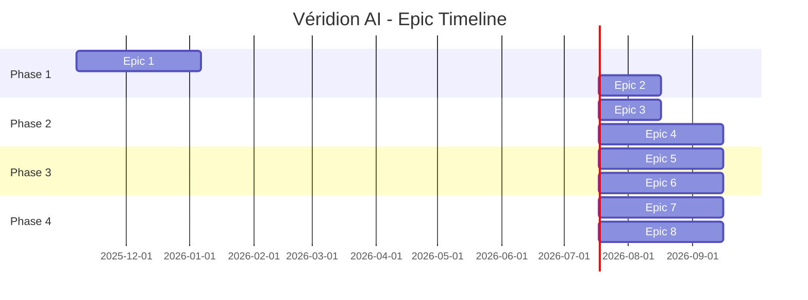

# Véridion AI - Project Roadmap Visual Summary

## Timeline Overview (12 Months)

```
Month:  1    2    3    4    5    6    7    8    9   10   11   12
        │────┴────┴────┴────┴────┴────┴────┴────┴────┴────┴────│
Phase:  ├─── Phase 1: MVP ────┤─ Phase 2: Automation ─┤
        │                      │                        │
        ├─────────────────────┼────── Phase 3: Intelligence ──┤
                               │                                │
                               └──────── Phase 4: Enterprise ───┤

Epics:  E1: Foundation
        ├── E2: Requirements
            ├── E3: Test Cases
                ├── E4: Scripts
                    ├── E5: Execution
                        ├── E6: Bug Triaging
                            ├── E7: Analytics
                                ├── E8: Enterprise
```

---

## Epic Progression & Dependencies



---

## Sprint Planning (2-week Sprints)

### Phase 1: MVP (Sprints 1-6)

#### Sprint 1-2 (Weeks 1-4): Foundation Setup
- **Epic 1: Foundation & Infrastructure**
- **Goal:** Database, API framework, authentication ready
- **Deliverables:**
  - ✅ PostgreSQL schema with 5 tables
  - ✅ FastAPI app with 10+ endpoints
  - ✅ JWT authentication working
  - ✅ Docker containers running

**Key User Stories:**
- US 1.1.1: Database Schema Design (P0, 8 SP)
- US 1.1.2: Database Migration Framework (P0, 5 SP)
- US 1.2.1: FastAPI Application Setup (P0, 8 SP)
- US 1.2.2: Authentication & Authorization (P0, 13 SP)

**Team Capacity:** 34 SP (4-6 people × 2 weeks)

---

#### Sprint 3-4 (Weeks 5-8): Requirement Synthesis
- **Epic 2: Requirement Synthesis Module**
- **Goal:** AI-powered requirement processing functional
- **Deliverables:**
  - ✅ OpenAI GPT-4 integration
  - ✅ User story generation working
  - ✅ Gherkin acceptance criteria created
  - ✅ Clarity scoring implemented

**Key User Stories:**
- US 2.1.1: OpenAI API Integration (P0, 8 SP)
- US 2.2.1: Unstructured Input Processing (P0, 13 SP)
- US 2.2.2: User Story Generation (P0, 13 SP)
- US 2.2.3: Gherkin Generation (P0, 13 SP)

**Team Capacity:** 47 SP

---

#### Sprint 5-6 (Weeks 9-12): UI & Refinement
- **Epic 2 (continued): Requirement UI**
- **Goal:** Complete requirement synthesis feature
- **Deliverables:**
  - ✅ Requirement synthesis UI
  - ✅ Review & approval workflow
  - ✅ Ambiguity detection active
  - ✅ 100+ requirements processed

**Key User Stories:**
- US 2.2.4: Clarity Score Calculation (P1, 8 SP)
- US 2.2.5: Ambiguity Detection (P1, 13 SP)
- US 2.3.1: Synthesis Interface (P1, 13 SP)
- US 2.3.2: Review & Approval (P1, 8 SP)

**Team Capacity:** 42 SP

---

### Phase 2: Automation (Sprints 7-12)

#### Sprint 7-8 (Weeks 13-16): Test Case Engine
- **Epic 3: Test Case Generation**
- **Goal:** Automated test case creation
- **Deliverables:**
  - ✅ Positive test generation
  - ✅ Negative test generation
  - ✅ Boundary/edge cases
  - ✅ Mock data generator

**Key User Stories:**
- US 3.1.1: Positive Test Generation (P0, 13 SP)
- US 3.1.2: Negative Test Generation (P0, 13 SP)
- US 3.1.3: Boundary & Edge Cases (P1, 13 SP)
- US 3.2.1: Realistic Data Generation (P1, 13 SP)

**Team Capacity:** 52 SP (6-8 people)

---

#### Sprint 9-10 (Weeks 17-20): Script Generation - Part 1
- **Epic 4: Automation Script Generator**
- **Goal:** Playwright script generation working
- **Deliverables:**
  - ✅ Playwright/Python scripts generated
  - ✅ POM pattern implemented
  - ✅ Script configuration UI
  - ✅ 50+ scripts created

**Key User Stories:**
- US 4.1.1: Playwright Script Gen (P0, 21 SP)
- US 4.1.4: Naming Convention (P1, 5 SP)
- US 4.3.1: Configuration Interface (P1, 8 SP)
- US 4.3.2: Script Preview (P1, 8 SP)

**Team Capacity:** 42 SP

---

#### Sprint 11-12 (Weeks 21-24): Script Generation - Part 2
- **Epic 4 (continued): CI/CD Integration**
- **Goal:** Complete automation framework
- **Deliverables:**
  - ✅ GitHub Actions integration
  - ✅ Selenium support added
  - ✅ Scripts deployed to repos
  - ✅ 200+ scripts generated

**Key User Stories:**
- US 4.1.2: Selenium Script Gen (P1, 21 SP)
- US 4.2.1: GitHub Actions Gen (P0, 13 SP)
- US 4.2.3: Script Deployment (P1, 13 SP)

**Team Capacity:** 47 SP

---

### Phase 3: Intelligence (Sprints 13-18)

#### Sprint 13-14 (Weeks 25-28): Test Execution
- **Epic 5: Test Execution & CI/CD**
- **Goal:** Automated test execution functional
- **Deliverables:**
  - ✅ CI/CD triggered execution
  - ✅ Result parsing (JUnit, Allure)
  - ✅ Artifact storage (screenshots, videos)
  - ✅ Execution logs created

**Key User Stories:**
- US 5.1.2: CI/CD Triggered Execution (P0, 13 SP)
- US 5.2.1: Test Result Parsing (P0, 13 SP)
- US 5.2.2: Artifact Storage (P1, 13 SP)
- US 5.2.3: Execution Log Creation (P0, 8 SP)

**Team Capacity:** 47 SP

---

#### Sprint 15-16 (Weeks 29-32): AI Root Cause Analysis
- **Epic 6: Bug Triaging & RCA**
- **Goal:** AI-powered failure analysis working
- **Deliverables:**
  - ✅ Failure pattern recognition
  - ✅ Root cause categorization
  - ✅ Suggested fixes generated
  - ✅ 80%+ accuracy achieved

**Key User Stories:**
- US 6.1.1: Failure Pattern Recognition (P0, 21 SP)
- US 6.1.3: Suggested Fix Generation (P1, 13 SP)
- US 6.2.1: Bug Report Creation (P0, 13 SP)

**Team Capacity:** 47 SP

---

#### Sprint 17-18 (Weeks 33-36): Bug Tracking Integration
- **Epic 6 (continued): External Integrations**
- **Goal:** Complete bug triaging feature
- **Deliverables:**
  - ✅ Jira integration functional
  - ✅ Azure DevOps integration
  - ✅ Bug review UI
  - ✅ 500+ bugs auto-created

**Key User Stories:**
- US 6.2.2: Jira Integration (P0, 13 SP)
- US 6.2.3: Azure DevOps Integration (P2, 13 SP)
- US 6.3.1: Bug Report Review UI (P1, 8 SP)
- US 6.3.2: Bug Tracking Dashboard (P2, 8 SP)

**Team Capacity:** 42 SP

---

### Phase 4: Enterprise (Sprints 19-24)

#### Sprint 19-20 (Weeks 37-40): Analytics Dashboard
- **Epic 7: Analytics & Reporting**
- **Goal:** Executive insights and metrics
- **Deliverables:**
  - ✅ Main dashboard functional
  - ✅ Quality gate visualization
  - ✅ Trend analysis working
  - ✅ Automated reports generated

**Key User Stories:**
- US 7.1.1: Test Metrics Calculation (P0, 13 SP)
- US 7.1.2: Trend Analysis (P1, 13 SP)
- US 7.2.1: Main Dashboard (P0, 13 SP)
- US 7.2.2: Quality Gate Visualization (P0, 8 SP)

**Team Capacity:** 47 SP

---

#### Sprint 21-22 (Weeks 41-44): Multi-Tenancy
- **Epic 8: Enterprise Features**
- **Goal:** SaaS-ready platform
- **Deliverables:**
  - ✅ Tenant isolation implemented
  - ✅ Tenant management UI
  - ✅ 10+ tenants supported
  - ✅ Usage tracking per tenant

**Key User Stories:**
- US 8.1.1: Tenant Isolation (P1, 21 SP)
- US 8.1.2: Tenant Management (P1, 13 SP)
- US 8.2.1: Query Optimization (P1, 13 SP)

**Team Capacity:** 47 SP

---

#### Sprint 23-24 (Weeks 45-48): Security & Scale
- **Epic 8 (continued): Production Ready**
- **Goal:** Enterprise-grade platform
- **Deliverables:**
  - ✅ SSO integration (SAML/OAuth)
  - ✅ Audit logging complete
  - ✅ GDPR compliance features
  - ✅ 100+ concurrent users supported

**Key User Stories:**
- US 8.2.2: Horizontal Scaling (P1, 21 SP)
- US 8.3.1: SSO Integration (P1, 21 SP)
- US 8.3.2: Audit Logging (P1, 13 SP)

**Team Capacity:** 55 SP

---

## Cumulative Progress Chart

```
Story Points Completed Over Time

300 ┤                                                    ●── Phase 4
    │                                              ●────/
250 ┤                                        ●────/
    │                                  ●────/
200 ┤                            ●────/
    │                      ●────/  └── Phase 3
150 ┤                ●────/
    │          ●────/
100 ┤    ●────/  └── Phase 2
    │●──/
50  ├/  └── Phase 1
    │
0   └┬────┬────┬────┬────┬────┬────┬────┬────┬────┬────┬────┬
    S1   S4   S6   S8  S10  S12  S14  S16  S18  S20  S22  S24
```

---

## Resource Allocation by Phase

```
Team Size Over Time

8  ┤      ┌─────────────────────────────────┐
7  ┤      │         Phase 2 & 3             │
6  ┤ ┌────┤                                 ├────┐
5  ┤ │    │                                 │    │
4  ┤ │    └─────────────────────────────────┘    │
3  ┤ │   Phase 1                           Phase 4
2  ┤ │                                            │
1  ┤ │                                            │
0  └─┴────┴────┴────┴────┴────┴────┴────┴────┴───┴
    M1   M3   M5   M7   M9  M11  M13  M15  M17  M19

Roles:
■ Backend Engineers (2-3)
■ Frontend Engineers (2)
■ DevOps Engineer (1)
■ AI/ML Engineer (0-1)
■ QA Engineer (1)
■ Tech Lead (1)
■ Product Manager (1)
```

---

## Critical Path Analysis

### Must-Complete Dependencies

```
Epic 1 (Foundation)
    ↓
Epic 2 (Requirements) ──────┐
    ↓                        │
Epic 3 (Test Cases) ────────┤
    ↓                        │  Can parallelize
Epic 4 (Scripts) ───────────┤  with UI work
    ↓                        │
Epic 5 (Execution) ─────────┘
    ↓
Epic 6 (Bug Triaging)
    ↓
Epic 7 (Analytics) ─────────┐
    ↓                        │  Can parallelize
Epic 8 (Enterprise) ────────┘
```

**Critical Path Duration:** 10-11 months (core features)  
**Full Completion:** 12 months (with enterprise features)

---

## Risk & Buffer Management

### Built-in Buffers

| Phase | Planned Duration | Buffer | Total |
|-------|------------------|--------|-------|
| Phase 1 | 2.5 months | 0.5 months | 3 months |
| Phase 2 | 2.5 months | 0.5 months | 3 months |
| Phase 3 | 2.5 months | 0.5 months | 3 months |
| Phase 4 | 2.5 months | 0.5 months | 3 months |

### Contingency Plans

**If Behind Schedule:**
1. **Defer P2/P3 features** to post-MVP
2. **Reduce scope** of Enterprise epic (move to v1.1)
3. **Add resources** (contractors for specific skills)
4. **Parallelize work** where dependencies allow

**If Ahead of Schedule:**
1. **Add polish** to UI/UX
2. **Improve test coverage** to 95%+
3. **Add documentation** and tutorials
4. **Implement P3 features** early

---

## Definition of Done (DoD) Checklist

### Feature Level
- [ ] Code complete and peer-reviewed
- [ ] Unit tests written (80%+ coverage)
- [ ] Integration tests passing
- [ ] API documentation updated
- [ ] UI responsive and accessible
- [ ] Performance benchmarks met
- [ ] Security review completed
- [ ] Product Owner approved

### Epic Level
- [ ] All user stories completed
- [ ] End-to-end tests passing
- [ ] Load testing completed
- [ ] Documentation complete
- [ ] Demo prepared and delivered
- [ ] Deployed to staging
- [ ] Stakeholder sign-off received

### Phase Level
- [ ] All epics completed
- [ ] Success criteria met
- [ ] Production deployment successful
- [ ] User training completed
- [ ] Retrospective conducted
- [ ] Lessons learned documented

---

## Velocity Tracking

### Expected Velocity by Phase

| Phase | Team Size | SP per Sprint | Sprints | Total SP |
|-------|-----------|---------------|---------|----------|
| Phase 1 | 4-6 | 38-42 | 6 | 228-252 |
| Phase 2 | 6-8 | 45-52 | 6 | 270-312 |
| Phase 3 | 6-8 | 45-47 | 6 | 270-282 |
| Phase 4 | 4-6 | 47-55 | 6 | 282-330 |

### Actual vs. Planned (Track Weekly)

```
Sprint Velocity Chart (Example)

SP  60 ┤
    55 ┤     ●────●────●        ●────●
    50 ┤●────┘                  │
    45 ┤                  ●────●
    40 ┤            ●────┘
    35 ┤      ●────┘
    30 ┤●────┘
       └┴────┴────┴────┴────┴────┴────┴
        S1   S2   S3   S4   S5   S6   S7

● Actual    ■ Planned
```

---

## Next Steps

### Immediate Actions (Week 1)
1. **Finalize team composition** - Hire/assign team members
2. **Set up infrastructure** - AWS/Azure accounts, repos, tooling
3. **Sprint 1 planning** - Break down US 1.1.1, 1.1.2, 1.2.1
4. **Kick-off meeting** - Align team on vision and goals

### Weekly Cadence
- **Monday:** Sprint planning (if new sprint)
- **Daily:** 15-min standup
- **Wednesday:** Mid-sprint check-in
- **Friday:** Demo & retrospective (end of sprint)

### Monthly Reviews
- **Stakeholder demos** - Show progress
- **Roadmap adjustments** - Based on learnings
- **Budget review** - Track burn rate
- **Risk assessment** - Update risk register

---

**Document Status:** Ready for Execution  
**Approved By:** [Pending]  
**Start Date:** TBD  
**Target Completion:** 12 months from start
