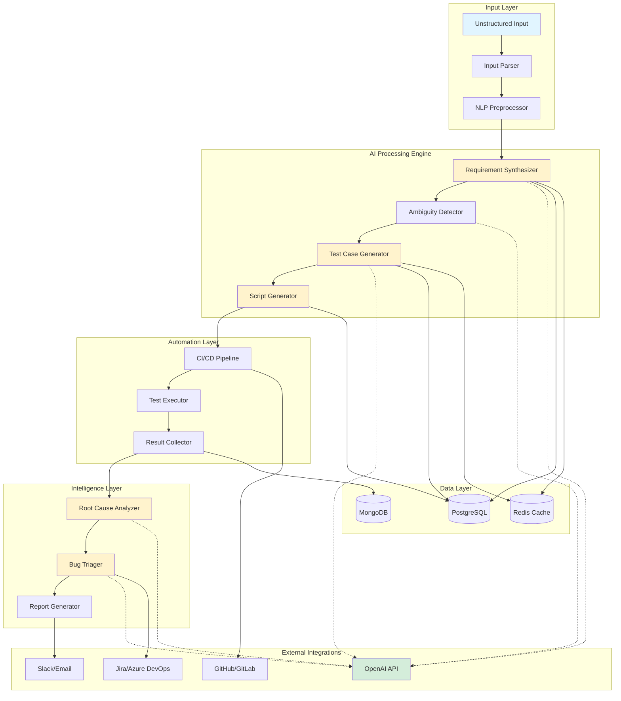
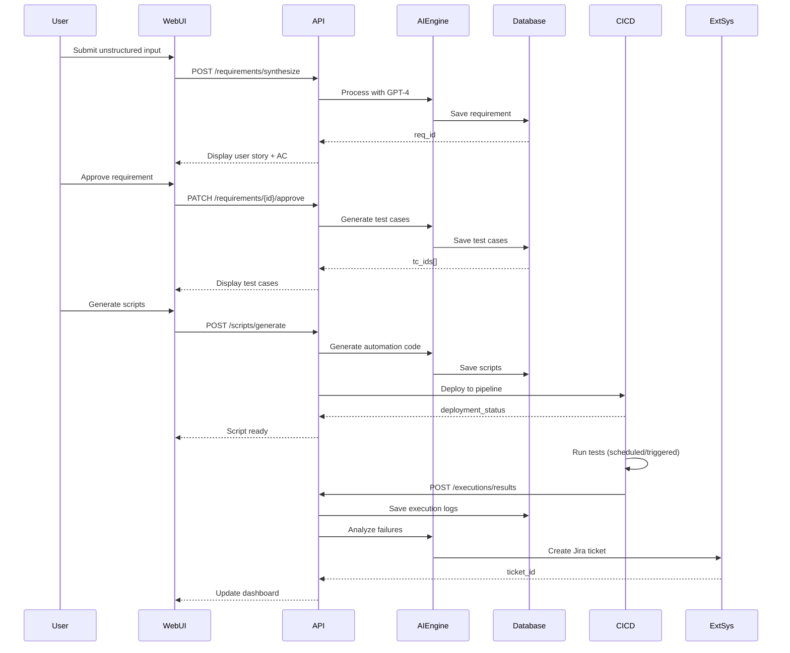
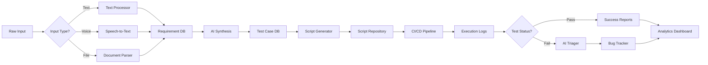
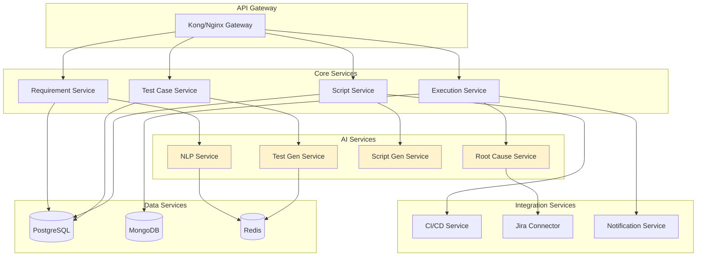
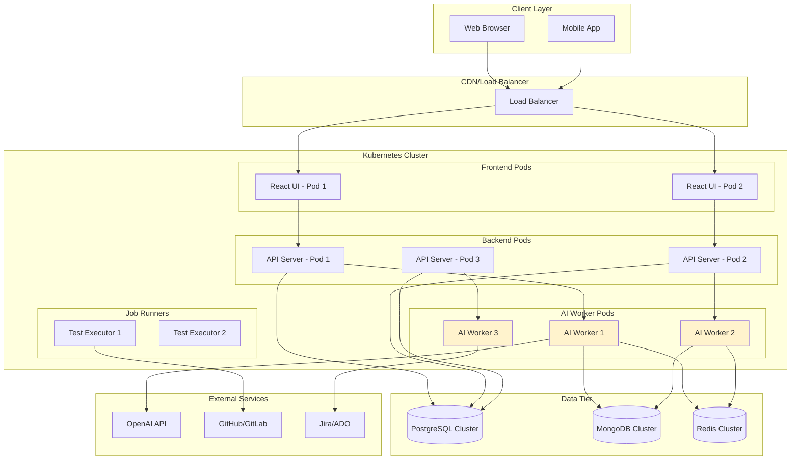
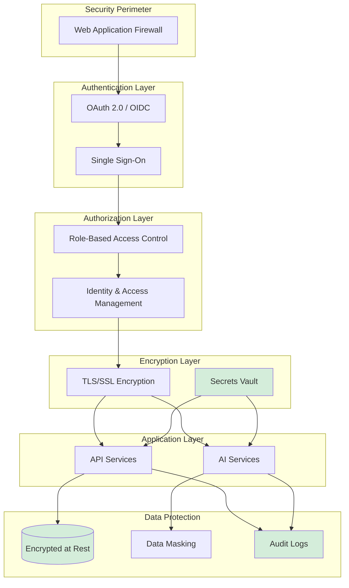

# Véridion System Architecture

## High-Level Architecture Diagram

## Component Communication Flow

## Data Flow Architecture

## Microservices Architecture

## Deployment Architecture

## Security Architecture

